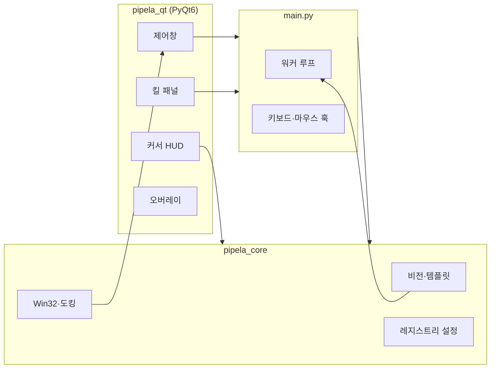

<p align="center">
  
</p>

<h1 align="center">Pipela</h1>

<p align="center">
  <strong>이터널시티를 위한 게임 도킹형 자동화·킬 카운터 도구</strong><br/>
  게임 창에 붙는 제어 패널, 템플릿 비전, 커서 HUD — PyQt6 기반 Windows 데스크톱 앱
</p>

<p align="center">
  <a href="https://github.com/Baegovda/PipEL.A/releases/latest">
    
  </a>
  <a href="https://www.python.org/">
    
  </a>
  <a href="https://www.riverbankcomputing.com/software/pyqt/">
    
  </a>
  
</p>

<p align="center">
  <a href="#-다운로드">다운로드</a> ·
  <a href="#-주요-기능">기능</a> ·
  <a href="#-빠른-시작">빠른 시작</a> ·
  <a href="#-개발">개발</a> ·
  <a href="#-빌드">빌드</a>
</p>

---

## ✨ 한 줄 요약

**Pipela**는 이터널시티 클라이언트 옆에 도킹되는 오버레이·제어창으로, 반복 플레이 동작(리로드·탄약·라이드·용병·플레임 등)을 템플릿 매칭과 입력 자동화로 돕고, OCR 기반 **킬 카운터**로 사냥 통계를 실시간 추적합니다.

---

## 🎯 주요 기능

### 게임 연동 UI

| | |
|---|---|
| **사이드 도킹** | 게임·런처 창에 제어 패널·킬 패널을 좌/우에 스냅 |
| **타이틀 스트립** | 게임 상단에 Pipela 상태 스트립 오버레이 |
| **DPI 대응** | 해상도·배율 변경 시 도킹 geometry 재계산 |
| **시스템 트레이** | 백그라운드 상주, 트레이에서 종료 |

### 자동화 매크로

| 기능 | 설명 |
|------|------|
| **Left Click** | 좌클릭 홀드 시 자동 연사 |
| **Right Hold** | 우클릭 토글 유지 |
| **Flame Trigger** | 플레임 타이밍 자동 입력 + HUD |
| **Reload** | `F5` — 탄창·노탄 템플릿 기반 자동 리로드 |
| **Ammo Restock** | `F6` — 탄약 구매·보급 시퀀스 |
| **Ride** | 라이드 템플릿 감지·자동 탑승 |
| **HP Refill** | HP 회복 키 자동 입력 |
| **Call Merc** | 용병 소환 UI 자동 조작 |
| **Start Game** | 런처·인트로 스킵 등 기동 자동화 |

### 킬 카운터

- 게임 화면 OCR로 킬 수 추적
- 등급·몬스터킬 구간·일일 캘린더·막대 차트
- 게임 창 옆 **킬 패널** 플로터 도킹

### 비전·입력

- OpenCV `matchTemplate` + 사용자 정의 ROI
- 드래그 캡처로 템플릿 등록·미리보기
- **커서 HUD** — DirectComposition 네이티브 오버레이 (이동·사격·라이드 아이콘)
- 터미널 로그 — 줄 단위 페이드·아카이브



---

## 📥 다운로드

### 릴리스 (권장)

1. [**Releases**](https://github.com/Baegovda/PipEL.A/releases/latest) 에서 최신 버전 받기
2. **`Pipela-<버전>-win64.zip`** 압축 해제 *(0.9.14부터 — 이전 버전은 단일 `Pipela.exe`일 수 있음)*
3. **`Pipela\Pipela.exe`** 실행

앱 내 **설정 → 업데이트**에서도 새 버전 확인·다운로드 페이지 이동이 가능합니다.

### 선택 의존성

| 구성 요소 | 용도 | 설치 |
|-----------|------|------|
| **Tesseract OCR** | 킬 카운터 숫자 인식 | [Windows 설치 파일](https://github.com/UB-Mannheim/tesseract/wiki) + `pip install pytesseract` |
| **DComp HUD DLL** | 커서 아이콘 HUD (개발 빌드) | `native\cursor_hud_dcomp\build_dcomp.bat` |

---

## 🚀 빠른 시작

```
1. 이터널시티(또는 스마트 업데이터) 실행
2. Pipela 실행 → 제어창이 게임 옆에 도킹되는지 확인
3. 필요한 기능 토글 ON
4. 템플릿·ROI는 설정 탭에서 캡처·조정
```

### 자주 쓰는 단축키

| 키 | 동작 |
|----|------|
| **F5** | Reload 기능 ON/OFF |
| **F6** | Ammo Restock 기능 ON/OFF |
| **F8** | Pipela 종료 |
| **플레임 GUI 좌클릭** | Flame Trigger 기능 토글 |
| **플레임 GUI 휠클릭** | Flame Trigger 세션 ON *(기능이 켜져 있을 때)* |
| **트레이 우클릭** | 종료 |

> 설정·단축키·임계값은 대부분 **레지스트리**에 저장되며, 앱 재시작 후에도 유지됩니다.

---

## 🛠 개발

**Windows 10/11 · Python 3.10+** 권장.

### Cursor / VS Code (F5)

```powershell
git clone https://github.com/Baegovda/PipEL.A.git
cd PipEL.A
```

1. **F5** → `Pipela: Build and Run` *(워크스페이스 `.venv` 자동 준비)*
2. 또는 터미널:

```powershell
python -m venv .venv
.\.venv\Scripts\pip install -r requirements.txt
python main.py
```

### 프로젝트 구조

```
Pipela/
├── main.py              # 진입·워커 루프·pipela_mod API
├── pipela_qt/           # PyQt6 UI 전부
├── pipela_core/         # Win32·비전·설정 (Qt 없음)
├── assets/              # 아이콘·기본 템플릿 PNG
├── native/              # DComp 커서 HUD DLL 소스
├── Pipela.spec          # PyInstaller onedir 스펙
└── AGENTS.md            # 에이전트·릴리스 절차 (기여자용)
```

---

## 📦 빌드

```bat
build.bat
```

| 산출물 | 경로 |
|--------|------|
| 실행 폴더 | `dist\Pipela\Pipela.exe` |
| 배포 zip | `dist\Pipela-<버전>-win64.zip` |

증분 빌드: `scripts\build_release.bat` · VS Code **Ctrl+Shift+B**

---

## 🔄 업데이트 manifest

`version.json` (main 브랜치) — 앱이 주기적으로 조회:

```json
{
  "version": "0.9.13",
  "download_url": "https://github.com/Baegovda/PipEL.A/releases/download/v0.9.13/Pipela.exe",
  "release_url": "https://github.com/Baegovda/PipEL.A/releases/tag/v0.9.13"
}
```

---

## 📋 변경 이력

사용자용 한국어 로그: [`UpdateLog/update_log.md`](UpdateLog/update_log.md)

---

## ⚠️ 면책

- Pipela는 **개인 편의 도구**이며, 이터널시티·네이버 등 제3자와 **무관**합니다.
- 게임 이용약관·운영정책 위반 여부는 **사용자 책임**입니다. 자동화 사용 전 반드시 확인하세요.
- 본 저장소는 교육·개인 프로젝트 목적으로 공개됩니다.

---

<p align="center">
  <sub>Made for Eternal City hunters · Pipela</sub>
</p>
