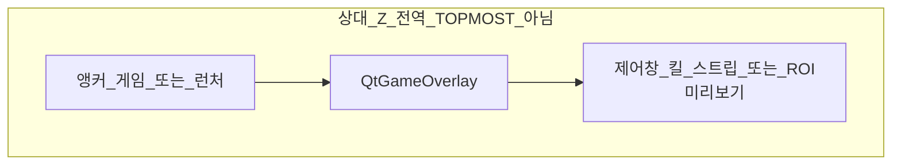

# Pipela 창 Z-order 및 배치 (Win32 / Qt)

이 문서는 Pipela가 **게임(또는 런처) HWND**를 기준으로 Qt 최상위 창들을 **어디에 두고(Z-order)**, **어떻게 붙이는지(공간 배치)** 를 코드 그대로 정리한 레퍼런스입니다.

- 요약·인시던트 메모: [`AGENTS.md`](AGENTS.md) §13(도킹 UI 페이즈), §15(`DOCK_GEOMETRY_AND_Z_SHARED`, `CLIENT_PHASE_DOCK_BURST`, `TITLE_STRIP_RIGHT_EDGE`, `CURSOR_HUD_DCOMP_NATIVE` 등)
- **상세·전수 목록은 본 문서**를 기준으로 합니다.

---

## 1. 개요·용어

| 용어 | 의미 |
|------|------|
| **앵커 HWND** | 도킹·오버레이·스트립이 따라가는 “기준 창”. 보통 이터널시티 `target_hwnd`, 없으면 스마트업데이터 런처 |
| **도킹 크롬(docked chrome)** | 게임 옆/위에 붙는 Pipela UI: 제어창, 킬 플로터, 타이틀 스트립 |
| **게임 오버레이** | `pipela_mod._qt_game_overlay` (`QtGameOverlay`) — 게임 rect 위 검정 레이어(colorkey) |
| **Z-order** | 같은 화면에서 **누가 위에 그려지는지** (Win32 `SetWindowPos` / owner / TOPMOST) |
| **공간 배치(도킹)** | 창의 **x,y,w,h** — `compute_side_dock_layout`, 스트립 `_compute_strip_geometry` 등 |
| **select_mode** | ROI 드래그 선택 중 — `main.select_mode` / `_state_set("select_mode")`; 게임 오버레이 추적 중단 등 |

### 1.1 Z-order vs 공간 배치

- **Z-order**는 Win32 스택(또는 Qt `raise_`)으로 결정됩니다.
- **배치**는 `get_window_rect` / `get_window_outer_rect_screen` + DPI 변환으로 물리·논리 좌표를 맞춥니다.
- 도킹 크롬은 **둘 다** `sync_docked_chrome_z_order`(Z) + `compute_side_dock_layout`(위치)를 씁니다.

### 1.2 도킹 UI 페이즈 (런타임, 레지스트리 아님)

`pipela_qt/dock_ui_phase.py`:

| 값 | 상수 | 조건 |
|----|------|------|
| `client` | `UI_DOCK_PHASE_CLIENT` | `target_hwnd` 있고 최소화 아님 |
| `launcher` | `UI_DOCK_PHASE_LAUNCHER` | 게임 없/최소화, 런처만 |
| `standby` | `UI_DOCK_PHASE_STANDBY` | 둘 다 없 |

판별 순서: **client → launcher → standby**.  
캐시: `PIPELA_DOCK_PHASE_CACHE_MS`(기본 28ms).

### 1.3 앵커 HWND 해석

`pipela_qt/qt_dock_anchor.py`:

- `resolve_dock_anchor_hwnd`: 게임 우선 → 런처 (`refresh_target_hwnd_if_needed` / `refresh_smart_updater_hwnd_if_needed`)
- `resolve_dock_anchor_from_session`: 이미 갱신된 `target_hwnd` / `launcher_hwnd` 만 사용(스트립 틱 등)
- `resolve_game_only_anchor_hwnd`: **킬 플로터 전용** — 게임만, 런처 폴백 없음

### 1.4 기본 Z 스택 (도킹 크롬·ROI 미리보기)



**아래 → 위:** 앵커 &lt; `_qt_game_overlay` &lt; 도킹 크롬(또는 ROI 미리보기).

일부 창(디버그 펄스, 영역/템플릿 **선택**, 스플래시, 트레이 메뉴)은 **전역 `HWND_TOPMOST`** 를 써서 이 스택 **밖**에서 화면 최상단에 올라갑니다.

---

## 2. Win32 기반 메커니즘 (`pipela_core/win32_window_ops.py`)

### 2.1 `win32_set_window_owner(hwnd_owned, hwnd_owner)`

- `GWLP_HWNDPARENT` (`SetWindowLongPtrW` / `SetWindowLongW`) 설정.
- **소유 창은 소유자보다 항상 위**에 쌓입니다.
- **전역 TOPMOST 밴드가 아님** → 다른 일반 앱이 포그라운스면 그 앱 위에 보일 수 있음(의도).
- `hwnd_owner=0` / `None` → 소유 관계 해제.
- 변경 후 `SetWindowPos(..., SWP_NOZORDER | SWP_NOACTIVATE | SWP_FRAMECHANGED)` 로 프레임 갱신.

### 2.2 `win32_set_window_topmost(hwnd, topmost)`

- `topmost=True`: `HWND_TOPMOST` (`-1`)
- `topmost=False`: `HWND_NOTOPMOST` (`-2`)
- `SWP_NOMOVE | SWP_NOSIZE | SWP_NOACTIVATE` — 위치·크기·포커스 유지.

### 2.3 `set_window_z_order_directly_above(hwnd_above, hwnd_below)`

- `SetWindowPos(hwnd_above, hwnd_below, 0,0,0,0, SWP_NOMOVE|SWP_NOSIZE|SWP_NOACTIVATE)`  
  → `hwnd_above`를 `hwnd_below` **바로 위** 한 단계.
- **쌍별 스로틀:** `_SWP_ZORDER_PAIR_MIN_SEC` = **1.55s** (환경변수 없음, 모듈 상수).
- 동일 `(ha, hb)` 1.55s 이내 재호출은 **무시**.
- 캐시 dict 최대 64쌍, 초과 시 pop.

### 2.4 `win32_set_window_outer_rect(hwnd, x, y, w, h)`

- Qt `setGeometry` 직후 **물리 픽셀** outer rect를 Win32에 한 번 더 맞춤(딸림·DPI 완화).
- 도킹 크롬, `QtGameOverlay`, 히든 `(-10000,…)` 이동에 공통 사용.

### 2.5 `win32_force_toolwindow_exstyle(hwnd)`

- `WS_EX_TOOLWINDOW` 켜기, `WS_EX_APPWINDOW` 끄기 → 작업 표시줄·Alt+Tab 일반 목록에서 제외.
- `pipela_qt/taskbar_hide.py` `PipelaTaskbarHideFilter`: 최상위 QWidget `Show` 시 + `QTimer.singleShot(0)` 재적용.

### 2.6 도킹 외곽 rect (`dock_outer_rect_touch_client_*`)

| 함수 | 붙는 면 |
|------|---------|
| `dock_outer_rect_touch_client_left` | 패널 **Win32 외곽 오른쪽** = 앵커 **클라이언트 왼** `client_left_phys` |
| `dock_outer_rect_touch_client_right` | 패널 **Win32 외곽 왼쪽** = 앵커 **클라이언트 오른** `client_right_phys` |

- 모니터 **작업 영역** `get_monitor_work_rect_phys` 로 y/h 클램프.
- 폭은 끝점 스냅 역산(125% DPI 1px 덮음 방지).

---

## 3. 공통 Z 스택 — `pipela_qt/qt_dock_z_stack.py`

### 3.1 `sync_docked_chrome_z_order(pipela_mod, wid, anchor, *, set_owner, force_z_restack=False)`

**Win32에서만** 동작 (`sys.platform != "win32"` → return).

순서:

1. `set_owner=True` 일 때만 `win32_set_window_owner(w, ah)`
2. **항상** `win32_set_window_topmost(w, False)` — 도킹 크롬은 전역 topmost **사용 안 함**
3. `ov = pipela_mod._qt_game_overlay` 가 있고 `ov.winId()` 유효하면:
   - `set_window_z_order_directly_above(oid, ah)` — 오버레이를 앵커 바로 위
   - `set_window_z_order_directly_above(w, oid)` — 크롬을 오버레이 바로 위
   - `_Z_STACK_LAST_KEY[w] = (ah, w, oid)`
4. 오버레이 없으면: `set_window_z_order_directly_above(w, ah)`, key `(ah, w, 0)`

**디듀프:** `force_z_restack=False` 이고 `_Z_STACK_LAST_KEY.get(w) == key` 이면 **전체 Z 재적용 생략**.

### 3.2 `clear_docked_chrome_z_stack_state(wid)`

- 스트립 `_move_hidden` 등에서 owner 해제 전 **dedupe 캐시** 제거.

### 3.3 소비자별 `set_owner` / `force_z_restack`

| 소비자 | `set_owner` | `force_z_restack` |
|--------|-------------|-------------------|
| `control_main._apply_computed_side_dock` | `lo != ah` (앵커 HWND 변경 시) | `lo != ah` |
| `kill_counter_window.dock_to_right_of_target_game` | `lo != ah` | **항상 `True`** |
| `game_title_bar_overlay._sync_z` | 호출자가 `anchor_changed` 등으로 전달 | `z_stale` 등 |

---

## 4. 공간 배치(도킹) — Z와 별개

### 4.1 `pipela_qt/qt_side_dock.py`

- `compute_side_dock_layout(pipela_mod, anchor, *, dock_w_log, side="left"|"right")`  
  → `SideDockLayout` (논리/물리 x,y,w,h, `dedupe_sig`)
- `clamp_dock_logical_geometry` — primary screen available area 안으로 x,y,w,h 제한
- `chrome_outer_rect_plausible_for_left_dock(ch_rect, cr, tol_phys=36)`  
  — 제어창 **외곽 오른** ≈ 앵커 **클라 왼** (±36px) 일 때만 Win32 제어창 좌표 신뢰
- `anchor_client_inner_height_logical_qt` — 킬/도킹 높이 = 클라 높이 규칙

**제어창 (`PipelaQtMainWindow`):**

- `_dock_to_anchor`: `side="left"` — 메인 Win32 **외곽 오른** = 앵커 **클라 왼** `cr[0]`
- 앵커 없음 → `_dock_to_standby_centered` (primary screen 중앙)
- `_apply_computed_side_dock`: Qt `setGeometry` + `win32_set_window_outer_rect` + `sync_docked_chrome_z_order`

**킬 플로터 (`KillCounterFloaterWindow`):**

- `resolve_game_only_anchor_hwnd` — 게임만
- `side="right"` — 킬창 **왼** = 클라 **오른** `cr[2]`
- `setFixedHeight` = 앵커 클라 높이(논리)
- 도킹 실패 시 `_KC_DOCK_RETRY_MAX` = **14** 회, 지연 `max(48, min(320, 40 + n*12))` ms
- `dedupe_sig` 동일하면 조기 return

**타이틀 스트립 (`QtGameTitleBarStrip._compute_strip_geometry`):**

- **launcher:** 스트립 폭 = 런처 outer/client `cr` (왼 overhang 방지)
- **client:** `right = cr[2]`; 킬 패널 visible 시 `max(..., kr)` 로 오른쪽 확장
- **left:** 제어 Win32 rect가 plausible 하면 그 왼쪽; 아니면 `compute_side_dock_layout(..., side="left")` 폴백
- 물리 rect → `win32_physical_screen_rect_to_qt_overlay_geometry` + `win32_set_window_outer_rect`

### 4.2 DPI 이중 좌표 (`pipela_qt/dpi.py`)

- `win32_physical_screen_rect_to_qt_overlay_geometry(pipela_mod, anchor_hwnd, x_phys, y_phys, w_phys, h_phys)`  
  — 거의 모든 오버레이·도킹·펄스 박스가 **물리 + Qt 논리** 둘 다 사용.

### 4.3 페이즈별 가시성 (`control_main._sync_launcher_phase_docked_chrome`)

| 페이즈 | 제어창 | 킬 플로터 | 스트립 |
|--------|--------|-----------|--------|
| `launcher` | hide | hide | 유지(런처 앵커) |
| `standby` | (킬 hide; 제어는 별도 standby 도킹) | hide | 앵커 없으면 `_move_hidden` |
| `client` | show + `_dock_to_anchor(force=True)` (× 닫지 않은 경우) | 정책에 따라 | 게임 앵커 |

`pipela_qt/dock_chrome_restore.py` — 게임 최소화 복구 시 제어·킬 복원; **launcher 페이즈에서는 복원 스킵**.

### 4.4 Client 페이즈 도킹 버스트

`control_main`:

- `_start_client_phase_dock_burst`: **10회**, **1초** 간격 (`_client_dock_burst_timer`)
- `_force_client_dock_resync`: dedupe/가드 없이 `compute_side_dock_layout` + `_apply_computed_side_dock`
- 해상도·클라 rect 변화: `_schedule_client_resolution_dock_retries` — 0, 48, 96, 180, 320, 620, 1200 ms
- `_maybe_extend_client_phase_dock_burst`: client 페이즈 중 burst 잔여를 최소 **12** 로 연장

### 4.5 게임 창 화면 중앙 (`main.apply_game_window_screen_center`)

- 레지스트리 `game_window_center_on_detect_enabled` (기본 on)
- `select_mode` 또는 비활성 시 생략
- HWND 변경 시 즉시 1회; 이후 `_GAME_CENTER_THROTTLE_SEC` = **0.72s**
- `control_main._game_center_timer`: **400ms** 간격으로 `_tick_apply_game_window_screen_center` (제어 `_refresh` 와 분리)

---

## 5. 창별 카탈로그 (HWND / Z / 배치 / 타이머)

### 5.1 `QtGameOverlay` — `pipela_qt/overlay.py`

| 항목 | 내용 |
|------|------|
| 전역 | `pipela_mod._qt_game_overlay` |
| Qt flags | `Tool \| FramelessWindowHint \| WindowStaysOnTopHint \| NoDropShadowWindowHint` |
| 속성 | `WA_ShowWithoutActivating`, `WA_TransparentForMouseEvents` |
| Win32 | `WS_EX_LAYERED` + `SetLayeredWindowAttributes` colorkey **#000000** |
| Z | Qt topmost 플래그 있으나 **도킹 크롬은 `sync_docked_chrome_z_order`로 항상 위**; 오버레이 틱에서 `reassert_z_order` **호출 안 함**(스트립 깜빡임 방지) |
| 배치 | 앵커 `get_window_rect` + 3px 패딩(물리); `select_mode` 이면 앵커 추적 안 함 |
| 타이머 | `pipela_overlay_tick_ms()` = 절전 시 `GAME_CLIENT_POWER_SAVE_LAYOUT_MS`(2500), 아니면 `display_tick_ms()` |
| 히든 | 앵커 없/최소화/running false → `(-10000,-10000,1,1)`, `_hidden_applied` 로 SetWindowPos 중복 방지 |

### 5.2 `QtGameTitleBarStrip` — `pipela_qt/game_title_bar_overlay.py`

| 항목 | 내용 |
|------|------|
| 전역 | `pipela_mod._qt_title_bar_strip` |
| Qt flags | `Tool \| FramelessWindowHint \| NoDropShadowWindowHint` — **`WindowStaysOnTopHint` 없음** |
| Z | `sync_docked_chrome_z_order` (`_sync_z`); owner는 **앵커 변경 시만** `set_owner=True` |
| Z 스로틀 | `_Z_REAPPLY_MIN_SEC` = **9.5s**; geom만 변할 때 `_STRIP_Z_ON_GEOM_MIN_SEC` (기본 **0.48s**, `PIPELA_STRIP_Z_ON_GEOM_MIN_SEC`) |
| 기하 스냅 | 비교용 32px 그리드 — DWM 잡음으로 매 틱 Z/SetWindowPos 폭주 방지 |
| Lift | `_win32_lift_strip_visible` — iconic 시 `SW_SHOWNA`; `_STRIP_WIN32_LIFT_MIN_SEC` = **1.25s** |
| 히든 | `_move_hidden`: owner=0, topmost off, `clear_docked_chrome_z_stack_state`; 이미 hidden 이면 **즉시 return**(SetWindowPos 폭주 차단) |
| 폴링 | `_strip_poll_interval_ms()` — 기하 안정 시 최대 **440ms**; 절전 시 `pipela_overlay_tick_ms()` 기반 |
| `reassert_z_order()` | 공개; 오버레이 `_tick` 에서는 **부르지 않음** |
| 앵커 변경 | 제어창 `QTimer.singleShot(0, _dock_to_anchor(force=True))` 연쇄 |

### 5.3 `PipelaQtMainWindow` — `pipela_qt/control_main.py`

| 항목 | 내용 |
|------|------|
| 전역 | `pipela_mod._qt_control_main` |
| Qt flags | `Window \| FramelessWindowHint` (일반 top-level, **StaysOnTopHint 없음**) |
| Z | 도킹 시 `sync_docked_chrome_z_order`; `raise_` 는 트레이 복귀·모달 등 UI용 |
| 배치 | `_dock_to_anchor` / standby 중앙 |
| 폴링 | `_poll` → `_refresh`, 간격 `_control_poll_interval_ms()` (모니터 Hz, 절전 시 ≥200ms) |
| `_last_z_anchor` | 앵커 변경 시에만 owner·force_z_restack |

### 5.4 킬 플로터 — `pipela_qt/kill_counter_window.py`

| 항목 | 내용 |
|------|------|
| Qt flags | `Window \| FramelessWindowHint` |
| Z | `sync_docked_chrome_z_order`, **`force_z_restack=True` 매 성공 도킹** |
| 배치 | `dock_to_right_of_target_game`, `side="right"` |
| show | `QTimer.singleShot(0/100, dock…)`; resize edge `raise_()` |

### 5.5 `QtRegionPreviewOverlay` — `pipela_qt/region_preview_overlay.py`

| 항목 | 내용 |
|------|------|
| 용도 | 저장된 감지 ROI **미리보기** (반투명 박스) |
| Qt flags | `Tool \| FramelessWindowHint \| NoDropShadowWindowHint`; **Win32가 아니면** `WindowStaysOnTopHint` 추가 |
| Win32 Z | **전역 TOPMOST 사용 안 함**(주석); `win32_set_window_topmost(wid, False)`; owner=anchor; `anchor → overlay → preview` 상대 Z |
| `raise_()` | Win32 경로에서는 **생략**(cProfile: Kill Counter preview) |
| Z heartbeat | `_z_heartbeat % 72 == 0` 또는 geom/anchor 변경 시 `_apply_stack_above_anchor` |
| 타이머 | `display_tick_ms()` — ROI rect·앵커 따라 geometry |
| 토글 | `main.toggle_region_preview_overlay` → `qt_region_preview_toggle` |

### 5.6 `QtClientRegionSelectOverlay` — `pipela_qt/region_drag_overlay.py`

| 항목 | 내용 |
|------|------|
| 용도 | 감지 영역 **드래그 선택** |
| Qt flags | `Tool \| FramelessWindowHint \| WindowStaysOnTopHint \| NoDropShadowWindowHint` |
| Win32 Z | `_win32_set_topmost_no_activate` (`HWND_TOPMOST`, `SWP_NOACTIVATE`) + `raise_` + `activateWindow` + 포커스 |
| 상태 | `select_mode=True`; `main._force_close_region_select_overlay_only` |
| 상호 배타 | 템플릿 캡처 시작 시 region/template 서로 `_force_close_*` (`main.py`) |

### 5.7 `QtTemplateCaptureOverlay` — `pipela_qt/template_drag_overlay.py`

| 항목 | 내용 |
|------|------|
| 용도 | 템플릿 PNG **드래그 캡처** |
| Z/플래그 | region 선택과 **동일** (`_win32_set_topmost_no_activate`, StaysOnTopHint) |
| 확인 UI | `template_capture_confirm.py` — 별도 `CardFramelessDialog` + `WindowStaysOnTopHint` (게임 스택 무관) |

### 5.8 `QtDebugPulseOverlay` — `pipela_qt/debug_pulse_overlay.py`

| 항목 | 내용 |
|------|------|
| 전역 | `pipela_mod._qt_debug_pulse_overlay` (생성만, 항상 show 아님) |
| 큐 | `main._template_debug_overlay_queue`, `main._kill_counter_overlay_queue` |
| Qt flags | `Tool \| FramelessWindowHint \| WindowStaysOnTopHint`; `WA_TranslucentBackground`, `WA_TransparentForMouseEvents` |
| Z | 전역 topmost + `raise_`; `_defer_raise` 스로틀 **0.85s** |
| 펄스 dedupe | 동일 sig **0.4s** 내 재시작 무시 |
| 표시 | 3s 후 hide; 초기 geometry `(-10000,…)` |
| 폴링 | `pipela_kill_counter_overlay_poll_ms()` (절전 시 2000ms, 아니면 `display_tick_ms()`, 최소 16ms) |
| 테스트 캡처 | `prepare_template_test_capture()` — 큐 비우고 hide (mss/match에 박스 섞임 방지) |

### 5.9 커서 / Flame HUD — `pipela_qt/cursor_hud.py` + native

**Qt 도킹 스택과 분리된 축.**

| 구성 | Z / 배치 |
|------|----------|
| `QtCursorHud` | `QObject`; DComp + `_CursorHudFlamePopup` 등 |
| `_CursorHudPopup` / Flame | `Tool \| FramelessWindowHint \| WindowStaysOnTopHint`; colorkey; `_win32_topmost_no_activate` 주기 **`PIPELA_CURSOR_HUD_TOPMOST_REFRESH_MS`** (기본 220ms) |
| **DComp** (`pipela_qt/dcomp_hud.py`, `cursor_hud_dcomp.dll`) | 별도 **native 최상위 호스트**; `hud_init(anchor_hwnd)`; 게임 rect에 DirectComposition 오프셋 — **§3 상대 Z 스택 미사용** |
| 정책 | DComp 기본 ON; `PIPELA_CURSOR_HUD_DCOMP=0` 으로 끔; 실패 시 아이콘 HUD silent off (Qt fallback 제거됨) |
| 입력 | 저수준 마우스/키 hook → `postEvent`; **폴링 타이머 없음**(아이콘) |

### 5.10 스플래시 — `pipela_qt/splash_screen.py`

- `WindowStaysOnTopHint \| FramelessWindowHint`
- `shell.run_qt_application` 중 `_splash_raise()` — 오버레이/스트립 초기화 때 splash가 위에 오도록

### 5.11 트레이 메뉴 — `pipela_qt/shell.py`

- `QMenu` + `WindowStaysOnTopHint`; `aboutToShow` → `menu.raise_()`, `windowHandle().raise_()`

### 5.12 카드/다이얼로그 (게임 앵커 스택 밖)

| 창 | Z |
|----|---|
| `CardFramelessDialog` (`card_popup_shell.py`) | `Dialog \| FramelessWindowHint`; topmost **없음**(부모/모달) |
| `template_capture_confirm` | `WindowStaysOnTopHint` |
| `kill_counter_tier_table_dialog` | `WindowStaysOnTopHint` + `_apply_tier_win32_topmost` |
| `control_main` 설정 다이얼로그 등 | `raise_()` 로 전면 |

### 5.13 compat shim — `pipela_qt_compat/`

- `region_preview_overlay.py`, `region_drag_overlay.py` — `pipela_qt.*` 재export만; Z 로직은 동일.

---

## 6. 상호작용·배타·캡처 정책

### 6.1 `select_mode`

- region/template 드래그 오버레이가 `select_mode=True` 설정.
- `QtGameOverlay._tick`: `select_mode` 이면 게임 rect 추적 **안 함**.
- `apply_game_window_screen_center`: `select_mode` 이면 생략.

### 6.2 오버레이 닫기 순서 (`main.py`)

- `start_region_select` / `start_template_capture`:  
  `_force_close_template_capture_overlay` ↔ `_force_close_region_select_overlay_only` 상호 닫기.
- region preview는 별도 토글(`toggle_region_preview_overlay`).

### 6.3 ROI 미리보기 vs 선택 vs 템플릿 캡처

| 모드 | Z 전략 |
|------|--------|
| 미리보기 | 상대 Z (owner + anchor→overlay→preview) |
| 영역/템플릿 **선택** | 전역 TOPMOST + 포커스 |
| 확인 다이얼로그 | Qt topmost 모달 |

### 6.4 화면 캡처와 Pipela 레이어 (`pipela_core/vision_lazy.py`)

- MSS `CAPTUREBLT` **비활성** 패치 — layered/topmost Pipela 창이 비트맵에 안 섞이는 것이 템플릿 매칭에도 유리(AGENTS.md §14).
- Z 문서와 별개이나, **매칭용 grab에는 오버레이가 포함되지 않는** 정책과 맞물림.

---

## 7. Qt 앱 기동 순서 (`pipela_qt/shell.py` `run_qt_application`)

Z 관련 객체가 생기는 순서:

1. `PipelaApplication` + `PipelaTaskbarHideFilter` (Show 시 toolwindow exstyle)
2. `create_startup_splash` — topmost splash
3. **`QtGameOverlay`** → `show`, `_qt_game_overlay` 등록, `_splash_raise`
4. **`QtGameTitleBarStrip`** → `show`, `_splash_raise`
5. **`QtDebugPulseOverlay`** 생성 (아직 펄스 시에만 show)
6. **`QtCursorHud`** — `QTimer.singleShot(0, show)` (좌표는 `_HIDDEN` 선설정)
7. **`PipelaQtMainWindow`** — `_qt_control_main`, `_splash_raise`
8. 트레이·백그라운드 스레드 지연 시작
9. `finish_startup_splash` 후 `app.exec()`
10. 종료: cursor HUD close → title strip close → overlay close

이 시점부터 도킹 크롬 Z는 앵커·오버레이가 준비된 뒤 `sync_docked_chrome_z_order` 로 유지됩니다.

---

## 8. Qt 위젯 **내부** Z (HWND 아님)

동일 top-level 안에서만 유효:

| 위치 | 패턴 |
|------|------|
| `game_title_bar_overlay` | `ver.raise_()`, `br.raise_()`, `ic.raise_()`, `btn.stackUnder(_btn_min)` |
| `control_main` | 탭/모달 `raise_`, `prev.raise_()` |
| `kill_counter_window` | `_kc_resize_edge.raise_()` |
| 터미널 로그 | `ResizableTerminalLogList` 행 높이/페이드 — **별도 HWND 스택 없음** |

---

## 9. 타이머·스로틀·환경 변수 표

### 9.1 주요 타이머 간격

| 소스 | 간격 |
|------|------|
| `display_tick_ms()` | `1000 / display_refresh_hz()` (주 디스플레이) |
| `display_tick_ms_for_window(hwnd)` | 해당 모니터 Hz |
| `pipela_overlay_tick_ms()` | 절전 2500ms / else `control_gui_update_ms()` (= `display_tick_ms()`) |
| `pipela_kill_counter_overlay_poll_ms()` | 절전 2000ms / else `display_tick_ms()` |
| 제어 `_poll` | `max(28, display_tick_ms_for_window(control winId))` |
| 게임 중앙 | 400ms 타이머 → `apply_game_window_screen_center` (내부 0.72s 스로틀) |
| Z-order 쌍 | 1.55s (`set_window_z_order_directly_above`) |
| 스트립 Z 재적용 | 9.5s stale |
| 디버그 펄스 topmost raise | 0.85s |
| 디버그 펄스 sig dedupe | 0.4s |

### 9.2 환경 변수 (Z/도킹/오버레이 관련)

| 변수 | 기본 | 영향 |
|------|------|------|
| `PIPELA_DOCK_PHASE_CACHE_MS` | 28 | `get_ui_dock_phase` 캐시 TTL |
| `PIPELA_STRIP_Z_ON_GEOM_MIN_SEC` | 0.48 | 스트립: 기하만 변할 때 Z 재적용 최소 간격 |
| `PIPELA_DPI_MON_CACHE_SEC` | 0.85 | `get_dpi_for_monitor_containing_window` |
| `PIPELA_DEBUG_KILL_DOCK` | off | 킬 도킹 traceback |
| `PIPELA_CURSOR_HUD_DCOMP` | on | DComp HUD |
| `PIPELA_CURSOR_HUD_DCOMP_DLL` | — | DLL 경로 override |
| `PIPELA_CURSOR_HUD_TOPMOST_REFRESH_MS` | 220 | Qt HUD topmost 갱신 |
| `PIPELA_NO_SPLASH` | — | 스플래시 off (기동 Z 순서 동일, splash 없음) |

### 9.3 `main.py` 상수 (참고)

- `CONTROL_Z_SYNC_MIN_INTERVAL_SEC` = 0.05 — **현재 다른 모듈에서 참조되지 않음**(정의만 존재).
- `CONTROL_TASKBAR_EXSTYLE_REAPPLY_SEC` = 1.25 — 작업 표시줄 숨김 재적용 주기(필터는 Show 시).

---

## 10. 알고리즘 요약 (핵심 코드)

### 10.1 도킹 크롬 Z (`qt_dock_z_stack.py`)

```python
# 요약: owner(선택) → topmost(False) → overlay above anchor → chrome above overlay
if set_owner:
    win32_set_window_owner(w, ah)
win32_set_window_topmost(w, False)
# overlay 있으면: above(oid, ah); above(w, oid)
# 없으면: above(w, ah)
```

### 10.2 ROI 미리보기 Z (`region_preview_overlay._apply_stack_above_anchor`)

- `win32_set_window_topmost(wid, False)`
- owner 변경은 **앵커 HWND 변경 시만**
- `_qt_game_overlay` 있으면: `above(oid, anchor)` → `above(wid, oid)`; 없으면 `above(wid, anchor)`
- non-Win32: `raise_()` 폴백

### 10.3 전역 TOPMOST 보조 (`_win32_set_topmost_no_activate`)

- region/template 선택, debug pulse, cursor HUD Qt 경로
- `SetWindowPos(hwnd, HWND_TOPMOST, …, SWP_NOMOVE|SWP_NOSIZE|SWP_NOACTIVATE)`

---

## 11. 소스 파일 인덱스

### 11.1 Z-order / Win32

- [`pipela_core/win32_window_ops.py`](pipela_core/win32_window_ops.py)
- [`pipela_qt/qt_dock_z_stack.py`](pipela_qt/qt_dock_z_stack.py)

### 11.2 배치(도킹·geometry)

- [`pipela_qt/qt_side_dock.py`](pipela_qt/qt_side_dock.py)
- [`pipela_qt/qt_dock_anchor.py`](pipela_qt/qt_dock_anchor.py)
- [`pipela_qt/dock_ui_phase.py`](pipela_qt/dock_ui_phase.py)
- [`pipela_qt/dock_chrome_restore.py`](pipela_qt/dock_chrome_restore.py)
- [`pipela_qt/dpi.py`](pipela_qt/dpi.py)
- [`pipela_core/display_timing.py`](pipela_core/display_timing.py)

### 11.3 오버레이·크롬 창

- [`pipela_qt/overlay.py`](pipela_qt/overlay.py)
- [`pipela_qt/game_title_bar_overlay.py`](pipela_qt/game_title_bar_overlay.py)
- [`pipela_qt/control_main.py`](pipela_qt/control_main.py)
- [`pipela_qt/kill_counter_window.py`](pipela_qt/kill_counter_window.py)
- [`pipela_qt/region_preview_overlay.py`](pipela_qt/region_preview_overlay.py)
- [`pipela_qt/region_drag_overlay.py`](pipela_qt/region_drag_overlay.py)
- [`pipela_qt/template_drag_overlay.py`](pipela_qt/template_drag_overlay.py)
- [`pipela_qt/debug_pulse_overlay.py`](pipela_qt/debug_pulse_overlay.py)
- [`pipela_qt/overlay_chrome.py`](pipela_qt/overlay_chrome.py) — 페인팅만(Z 무관)
- [`pipela_qt/cursor_hud.py`](pipela_qt/cursor_hud.py), [`pipela_qt/dcomp_hud.py`](pipela_qt/dcomp_hud.py)
- [`pipela_qt/shell.py`](pipela_qt/shell.py)
- [`pipela_qt/splash_screen.py`](pipela_qt/splash_screen.py)
- [`pipela_qt/taskbar_hide.py`](pipela_qt/taskbar_hide.py)

### 11.4 진입·상태 (`main.py`)

- `pipela_overlay_tick_ms`, `pipela_kill_counter_overlay_poll_ms`
- `_force_close_*`, `toggle_region_preview_overlay`, `start_region_select`, `start_template_capture`
- `apply_game_window_screen_center`
- 큐: `_kill_counter_overlay_queue`, `_template_debug_overlay_queue`

### 11.5 compat

- [`pipela_qt_compat/region_preview_overlay.py`](pipela_qt_compat/region_preview_overlay.py)
- [`pipela_qt_compat/region_drag_overlay.py`](pipela_qt_compat/region_drag_overlay.py)

---

## 12. 분류 요약 (한눈에)

| 분류 | 창/기능 |
|------|---------|
| **상대 Z only** (앵커 &lt; overlay &lt; chrome) | 제어, 킬, 스트립, ROI **미리보기** |
| **Qt StaysOnTop + Win32 TOPMOST** | region/template **선택**, debug pulse, cursor HUD(Qt), splash, tray menu, 일부 dialog |
| **Qt StaysOnTop, Z는 크롬이 위로** | `QtGameOverlay` (실질 스택은 sync_docked) |
| **도킹 스택 밖** | DComp cursor HUD, Card/확인 모달, standby 중앙 제어창 |
| **히든 좌표** | overlay/debug pulse/스트립 hidden/cursor HUD 초기 — `(-10000,-10000,1,1)` |

---

*문서 버전: 저장소 현재 트리 기준. 동작 변경 시 본 파일과 [`AGENTS.md`](AGENTS.md) §13·§15를 함께 갱신하세요.*
