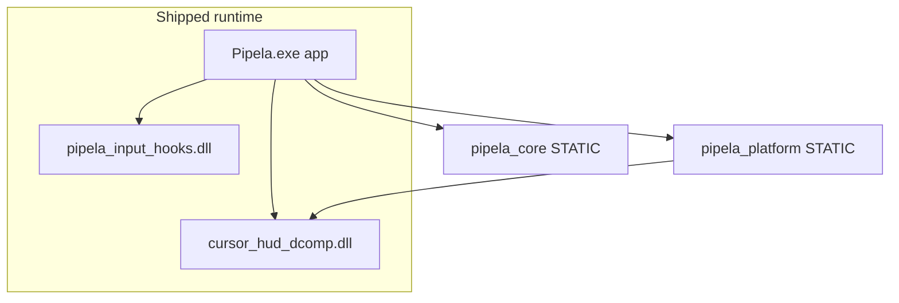

# Pipela C++ architecture (target)

`AUDIENCE`: agents and maintainers.  
`POLICY`: **C++-only ship** — see [`AGENTS.md` §1.1](../../AGENTS.md). Python tree is temporary parity scaffolding.

## Three layers

| Layer | Path | Role | Forbidden |
|-------|------|------|-----------|
| **core** | `cpp/src/core/` | Registry, vision, workers, Win32 HWND/capture/input synth | `#include <Qt*>` |
| **app** | `cpp/src/app/` | Qt6 UI, dock chrome, overlays, input bridge | Worker loop bodies |
| **native** | `cpp/src/native/` | LL hooks DLL, DComp HUD DLL, platform ctypes wrappers | Qt, registry UI |



## Target tree (Phase 5)

```
cpp/
├── CMakeLists.txt
├── vcpkg.json
├── registry/schema.json
└── src/
    ├── core/
    │   ├── include/pipela/core/   # public API only
    │   ├── state/ registry/ vision/ workers/ win32/
    ├── app/                       # was src/ui/
    │   ├── main.cpp
    │   ├── shell/ control/ dock/ overlays/
    │   ├── panels/settings/       # one file per panel (not monolithic hub)
    │   ├── widgets/ theme/ input/
    │   └── resources/             # theme.qrc + pipela_theme.json
    └── native/
        ├── input_hooks/
        ├── hud_dcomp/             # was repo native/cursor_hud_dcomp/
        └── platform/              # DComp wrapper (was pipela_native_layer)
```

## Naming rules

- CMake target `pipela_core` ≠ Python package `pipela_core/` (deleted Phase 6).
- Do not add a fourth `native/` path under app — use `app/input/` for Qt↔hook bridge.
- Canonical Python→C++ names: [`FILE_MAP.md`](FILE_MAP.md).

## Build outputs (not a single-file project)

Release zip contains **multiple files**: `Pipela.exe`, native DLLs, Qt/OpenCV runtime DLLs, `assets/`.

## Migration status

| Item | Status |
|------|--------|
| `ui/` → `app/` rename | In progress |
| `native/cursor_hud_dcomp` → `cpp/src/native/hud_dcomp` | In progress |
| `core/win32/dock_layout` → `app/dock/side_dock_layout` | Done |
| `settings_hub` → `panels/settings/*` | Factory + prefix panels (edit UI TBD) |
| pybind / Python tree | Delete Phase 6 |

See [`STATUS.md`](STATUS.md) for worker/runtime progress.
